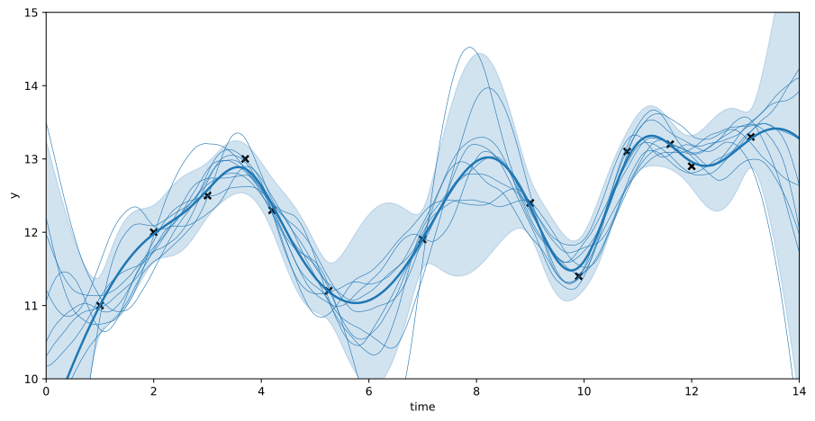

# Statistical Machine Learning Models from Scratch Using only NumPy

  

## Overview

This project is part of the course "Statistical Machine Learning" offered by the Intelligent Autonomous Systems Group at TU Darmstadt. The repository includes implementations of machine learning algorithms such as Bayesian regression, Gaussian Processes, Support Vector Machines, recurrent neural networks, and many more **from scratch using only NumPy**.

## Task 1

- Implementation of Markov Chains to calculate if a culture of bacteria contains mutants after several generations

## Task 2

- Implementation of Parametric Density Estimation methods such as bivariate Gaussian, log-likelihood methods, posterior methods, and decision boundaries
- Implementation of Non-Parametric Density Estimation methods such as histograms, Kernel Density Estimation, K-Nearest Neighbors, log-likelihood methods without a given distribution, and the Expectation-Maximization algorithm

## Task 3

- Implementations of linear regression, ridge regression, and polynomial ridge regression with different degrees
- Implementation of Bayesian linear regression with squared exponential features and uncertainty plots
- Classification using linear discriminant analysis
- Implementation of (Kernel) Principal Component Analysis for dimensionality reduction and classification purposes

## Task 4

- Implementation of Support Vector Machines with different kernels for binary classification tasks
- Implementation of Gaussian Processes for regression tasks
- Implementation of a feedforward neural network, including stochastic gradient descent, backpropagation, and a loss function for classification tasks using only NumPy
- Implementation of a recurrent neural network from scratch
